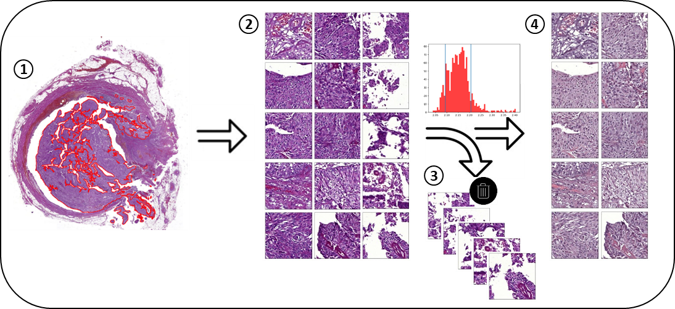
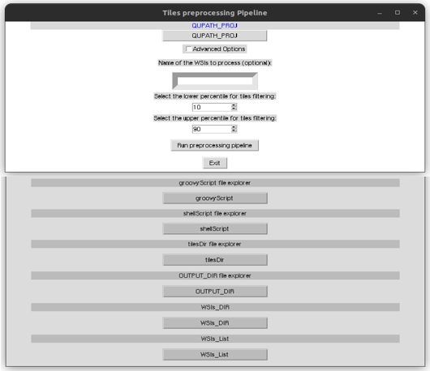

# *TilGenPro*: an automated Python-based pipeline for tiles generation and pre-processing 

## What is TilGenPro?
TilGenPro is an automated Python-based pipeline that, starting from a QuPath project of annotated whole slide images (WSIs), generates 512x512 pixel edge length square patches (tiles) from the annotated tumor area, filters out those characterized by a high amount of background, and stain normalize the tiles passing the filter using the Macenko method [1].



**Figure 1. Overview of *TilGenPro* workflow.** The annotated tumor area (red) within each slide belonging to the QuPath project (1) is tessellated into smaller tiles (patches) (2). Tiles first undergo a quality-filtering step basing on their log10-transformed median intensity values distribution (3) and afterwards are stain normalized (4).

More detailed information on how the quality-filtering step is implemented can be found in our manuscript ***Angeloni M., ...., Ferrazzi F., Bahlinger V. in preparation***.

## Software requirements and setup
TiGenPro has been implemented and tested to run on a remote server based on Ubuntu's 20.04.4 long-term support (LTS) operating system using QuPath v.0.2.3 and Python v.3.7.12. In order to be run, the following packages are required:

+ qupath [(from the svillal channel)](https://github.com/bayer-science-for-a-better-life/qupath-feedstock)
+ python
+ numpy
+ pandas
+ matplotlib
+ pillow
+ tqdm

To get started, clone the GitHub repository through the command:
``` bash
git clone https://github.com/MiriamAng/TilGenPro.git
````

We suggest to run the pipeline in a dedicated conda environment. This can be built through the provided yml file as follows:
``` bash
# Crete the conda environment tilGenProEnv
conda env create -f /path/to/TilGenPro/envFile.yml

# Activate the conda environment
conda activate tilGenProEnv
````
## How to run the pipeline?
### Default configuration settings
Once the GitHub repository has been cloned, the easiest way to run the pipeline is:
1) to navigate to the directory containing the script **tilesPreprocessing.py**
2) to run the script **tilesPreprocessing.py** by specifying the absolute path to the QuPath project file
``` bash
# Navigate to the directory containing the script tilesPreprocessing.py
cd path/to/TilGenPro/src

# Run the script tilesPreprocessing.py
python tilesPreprocessing.py path/to/qupath_proj_folder/project_name.qpproj
````
In this way, all the WSIs belonging to the QuPath project will be processed and the following folder's organization will be used to store the output of the pipeline:


By default, two new folders will be created in the same directory as the QuPath project, namely *tiles* and *results*.

+ *tiles*: contains as many subfolders as the number of WSIs processed. Each subfolder, in turn, stores all the tiles (jpeg format) generated from the respective annotated tumor area
+ *results*: contains the output of the pre-processing procedure
     + *preprocessingRes*: stores the results from filtering and stain-normalization
          + *normTiles*: contains, for a given WSI 
            + the histogram of the log10-transformed median intensity values distribution with the thresholds used for filtering highlighted in black
            + a pickle file storing a python dictionary where keys represent tile names and values the associated pixel intensities in the form of a numpy array
            + a log file storing the main information from tiles generation and filtering
          + *discTiles*: stores all the tiles (jpeg format) that did not pass the qualily-filtering step and were therefore discarded
     + *infoWSIs.csv*: stores information on the number of tiles generated for a given WSI (column 'numTilesInit') and of the tiles kept after the quality-filtering step (column 'numTilesAfterPreproc') stores all the tiles (jpeg format) that did not pass the qualily-filtering step.

## Customized configuration settings
The pipeline also allows for optional arguments according to user-specific requirements. 

| Optional Argument | Default Value | Description |
| --- | --- | --- |
| --groovyScript | ./TilGenPro/src/generateTiles.groovy | absolute path to the groovy script (.groovy) used for tiles generation |
| --shellScript | ./TilGenPro/src/runQupath.sh |  absolute path to the shell script (.sh) script used to run QuPath from terminal |
| --tilesDir  | QuPath project directory | absolute path to the directory where the tiles generated will be stored |
| --outputDir | QuPath project directory |  absolute path to the directory where the results from pre-processing will be stored |
| --wsiDir | None | absolute path to the folder containing the dataframe storing information on the WSIs to process |
| --jpgNormTiles | False | Save the normalized tiles in JPG other than as a pickle file |
| --wsiList | None | list of the full name(s) of the WSIs to process |
| --lowerPerc | 10 | percentile correspondent to the dark threshold on the log10-transformed median intesity pixel values distribution for a given WSI |
| --upperPerc | 90 | percentile correspondent to the white threshold on the log10-transformed median intesity pixel values distribution for a given WSI |  

The help documentation is easly accessible through the following command:
``` bash
python tilesPreprocessing.py --help
````
Notably, in case there is the need to process only a subset of the WSIs belonging to the QuPath project, these can be provided in input in two different ways:

1) by providing through the optional argument *--wsiDir* the absolute path to a folder containing a file called *slidesToProcess.csv* built by the user. 

**NOTE!** The file **has to** be called slidesToProcess.csv. It can contain as many column as wanted but it **must** contain at least a column called 'Slide' where are stored, in each row, the full names (e.g. wsi_name.mrxs) of the WSIs to process.

``` bash
python tilesPreprocessing.py path/to/qupath_proj_folder/project_name.qpproj --wsiDir path/to/data_frame
````

#### slidesToProcess.csv - Example 1

| **Slide** | 
| --- | 
| wsi1.mrxs | 
| wsi2.mrxs | 
| ... |
| wsiN.mrxs |

#### slidesToProcess.csv - Example 2

| **Slide** | X | Y | Z | ... | ... |
| --- | --- | --- | --- | --- | --- |
| wsi1.mrxs | ... | ... | ... | ... | ... |
| wsi2.mrxs | ... | ... | ... | ... | ... |
| ... | ... | ... | ... | ... | ... |
| wsiN.mrxs | ... | ... | ... | ... | ... |

#### slidesToProcess.csv - Example 3

| ... | X | Y | Z | ... |  **Slide** |
| --- | --- | --- | --- | --- | --- |
| ... | ... | ... | ... | ... |  wsi1.mrxs |
| ... | ... | ... | ... | ... | wsi2.mrxs |
| ... | ... | ... | ... | ... | ... |
| ... | ... | ... | ... | ... | wsiN.mrxs |

2) by specifying WSI(s) full name(s) (e.g. wsi_name.mrxs) through the optional argument *--wsiList*. If two or more WSIs are provided in input, their full names need to be separated by a space. 

**NOTE!** We recommend using the optional argument --wsiList only in case of a limited number of WSIs to process (e.g. 5)
``` bash
python tilesPreprocessing.py path/to/qupath_proj_folder/project_name.qpproj --wsiList wsi1.mrxs wsi2.mrxs
````
Finally, if the optional argument *--jpgNormTiles* is provided, all the normalized tiles belonging to a given WSI will be saved in JPG under the same folder path containing the normalization results.  

## GUI
A Graphical User Interface (GUI), one for Windows and the other one for Linux operating systems, has been developed and does not require any packages to be pre-installed. The download file can be found under [...]

### Windows operating system
1) Download the gui.exe file
2) Open the file by double clicking on the GUI icon

### Linux operating system
1) Download the gui.tar.xz file and navigate to the directory where the file was dowloaded
2) Unzip the compressed tar archive as follows:
``` bash
tar -xf gui.tar.xz
````
3) Open the file either:
    - by typing ```gui ``` in the command line
    - or by double clicking on the GUI icon
*Optional*: if you want to add the GUI to the global namespace of your command line (and being able to open it without navigating in the directory were the file was downloaded) use he following command:
``` bash
sudo cp ./gui ./usr/local/bin/name_you_want_to_call_the_gui
````
### Usage


**Figure 3. GUI appearance in Linux operating system.** The upper part in whites shows the default options provided by the GUI whereas the lower part in grey shows the advanced options made available by ticking the box *Advanced Options*

## Licence
The License file applies to all files within this repository. Whenever functions from third parties were used, their own license was included in the script.

## References
[1] M Macenko, M Niethammer, JS Marron, D Borland, JT Woosley, X Guan, C 
        Schmitt, NE Thomas. "A method for normalizing histology slides for 
        quantitative analysis". IEEE International Symposium on Biomedical 
        Imaging: From Nano to Macro, 2009 vol.9, pp.1107-1110, 2009.
